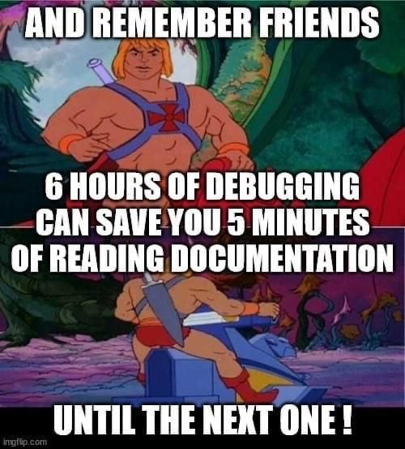

# Denis Policastro

__DevOps & Platform Engineer | AWS | Kubernetes | Terraform | Blockchain Enthusiast__

## 🧍 About me

As a DevOps Engineer with a solid background in both development and operations, I bring a unique perspective and skill set to my role. I began my career as a Full Stack Developer in 2014, 
gaining extensive experience in JavaScript, Golang, and Bash scripting, and I have recently developed a keen interest in languages like Rust. Transitioning to a DevOps-focused role in 2018, 
I have leveraged my development expertise to enhance my operations capabilities.

My experience as a consultant has been invaluable, providing me with a deep understanding of client requirements, 
the importance of deadlines, and the necessity of cost-effective solutions. This background enables me to deliver tailored DevOps strategies 
that meet specific business needs and drive operational efficiency.

I specialize in deploying resources on AWS using infrastructure as code tools like Terraform, creating robust CI/CD pipelines with Github Actions and ArgoCD,
running workloads in production environments with Kubernetes and monitoring everything using things like the Prometheus Stack.
My hands-on experience with these technologies allows me to build scalable, reliable, and secure infrastructures that support seamless development and deployment processes.

Throughout my career, I have collaborated closely with hundreds of developers, helping them improve their operational workflows and providing them with the tools and resources they need to excel in their roles. 
My goal is to bridge the gap between development and operations, fostering a culture of collaboration and continuous improvement. Additionally, I have a strong interest and experience in blockchain technologies, 
particularly in maintaining blockchain infrastructure, like Ethereum nodes, which further enriches my expertise and contributions to innovative projects.

## 👨‍💻 Skills

  
  
  
  
  
  
  
  <!-- Ref https://github.com/simple-icons/simple-icons/blob/develop/slugs.md -->

- __DevOps/SRE__
- __AWS__ - Computing, Networking, Security, Storage
- __CI/CD Pipelines__ - ArgoCD, AWS CodePipeline, Jenkins, Buildkite, Github Actions, Terraform Cloud
- __Containers__ - Kubernetes, Docker
- __Infra as Code__ - Terraform, CloudFormation, Ansible
- __Programming__ - JavaScript/TypeScript (Node.js, Angular), Golang, Python, Bash, Rust
- __Observability__ - Prometheus, Grafana, Thanos, New Relic, DataDog
- __Blockchain__ - Ethereum Node Operations

## 🥇 Certifications

- AWS Certified Solutions Architect - Associate
- CKAD - Cerfified Kubernetes Application Developer
- 
## :octocat: Github Stats

  
  

<!--
## 🌐 Open Source Projects

-->

<!--

-->

<!--
## 😆 And last but not least

  

**0xDones/0xDones** is a ✨ _special_ ✨ repository because its `README.md` (this file) appears on your GitHub profile.

Here are some ideas to get you started:

- 🔭 I’m currently working on ...
- 🌱 I’m currently learning ...
- 👯 I’m looking to collaborate on ...
- 🤔 I’m looking for help with ...
- 💬 Ask me about ...
- 📫 How to reach me: ...
- 😄 Pronouns: ...
- ⚡ Fun fact: ...

<h2 align="center">📊 Gɪᴛʜᴜʙ Sᴛᴀᴛs 📊</h2>

<h2 align="center">🏆 Gɪᴛʜᴜʙ Tʀᴏᴘʜɪᴇs 🏆</h2>

<h2 align="center">Lᴀɴɢᴜᴀɢᴇs ᴀɴᴅ Tᴏᴏʟs</h2> 

-->
